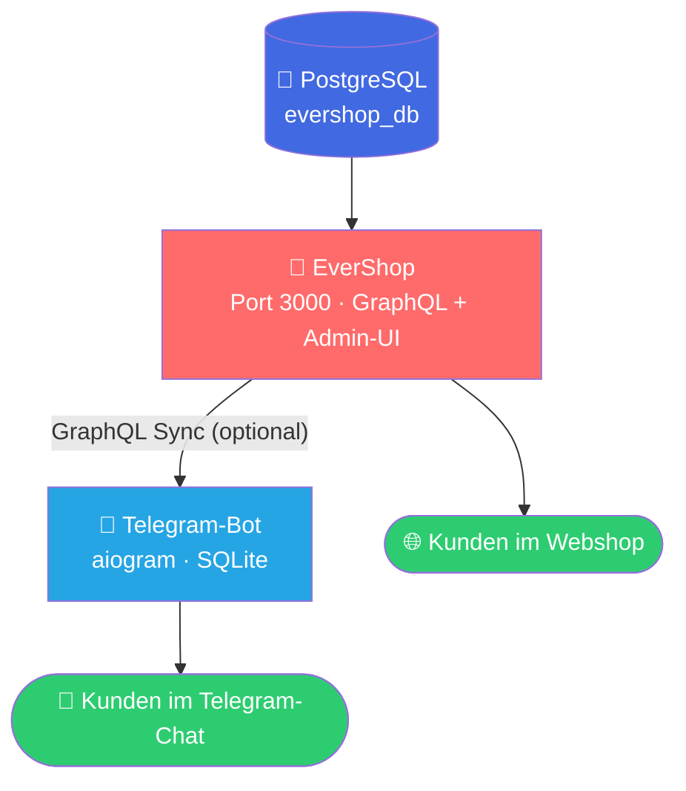

<div align="center">

# 🛍️ hAI.LLDesignShop

### Dein unabhängiger Webshop – raus aus Etsy, rein ins Self-Hosting

**EverShop** 🛒 + **Telegram-Shop-Bot** 🤖 als kombinierter Docker-Compose-Stack

[](https://www.docker.com/)
[](https://www.portainer.io/)
[](https://core.telegram.org/bots)
[](https://evershop.io/)

[](LICENSE)
[](https://www.python.org/)
[](https://nodejs.org/)
[](https://www.postgresql.org/)
[](https://www.sqlite.org/)
[]()
[]()

</div>

---

## 📖 Worum geht's?

`hAI.LLDesignShop` ist dein Fahrplan raus aus der Abhängigkeit von Etsy & Co. Ein
**vollwertiger, selbstgehosteter Webshop** kombiniert mit einem **schlanken Telegram-Bot**
für Direktverkauf im Chat – beides läuft als ein einziger Docker-Compose-Stack, den du
1:1 als **Portainer-Stack** importieren kannst.

Gedacht für kleine Shops mit bis zu **~50 Artikeln** – kein Overkill, keine unnötige Komplexität.

---

## 🧩 Architektur



Der Telegram-Bot hat eine **eigene, leichtgewichtige SQLite-Datenbank** und läuft komplett
unabhängig von EverShop. Über `sync_evershop.py` kannst du optional den Produktkatalog aus
EverShop übernehmen – Katalogpflege an einer Stelle, Verkauf über zwei Kanäle. ✨

---

## 🚀 Schnellstart

```bash
# 1️⃣ Repository klonen
git clone https://github.com/jbkunama1/hAI.LLDesignShop.git
cd hAI.LLDesignShop

# 2️⃣ Umgebungsvariablen vorbereiten
cp .env.example .env
nano .env   # Werte anpassen, siehe Tabelle unten 👇

# 3️⃣ Stack starten
docker compose up -d

# 4️⃣ Logs checken
docker compose logs -f
```

Danach:

- 🛒 **EverShop-Setup** unter `http://<host>:3000` öffnen und Einrichtungsassistent durchlaufen
- 🤖 **Telegram-Bot** in Telegram öffnen und `/start` senden

### 🔑 Wichtige `.env`-Werte

| Variable | Beschreibung | Woher? |
|---|---|---|
| `TELEGRAM_BOT_TOKEN` | Token für deinen Bot | 🔗 [@BotFather](https://t.me/BotFather) |
| `TELEGRAM_ADMIN_CHAT_ID` | Deine Chat-ID für Bestellbenachrichtigungen | 🔗 [@userinfobot](https://t.me/userinfobot) |
| `POSTGRES_PASSWORD` | DB-Passwort für EverShop | selbst setzen, sicher & zufällig 🔒 |
| `SESSION_SECRET` | Session-Secret für EverShop | selbst setzen, sicher & zufällig 🔒 |
| `SHOP_CURRENCY` | Angezeigte Währung | Standard: `EUR` |

---

## 📁 Projektstruktur

```
hAI.LLDesignShop/
├── 🐳 docker-compose.yml       # Gesamtstack: EverShop + DB + Telegram-Bot
├── ⚙️  .env.example             # Vorlage für Umgebungsvariablen
├── 🚫 .gitignore
├── 📄 README.md
├── 📜 LICENSE
└── 🤖 telegram-bot/
    ├── Dockerfile
    ├── requirements.txt
    ├── bot.py                 # Katalog, Warenkorb, Checkout
    ├── db.py                  # SQLite-Datenschicht
    └── sync_evershop.py       # Katalog-Abgleich via GraphQL
```

---

## 🤖 Telegram-Bot: Funktionsumfang

| Befehl | Was passiert |
|---|---|
| `/start` | 👋 Begrüßung & Menü |
| `/shop` | 🖼️ Katalog als Inline-Buttons (Bild, Beschreibung, Preis) |
| `/cart` | 🧺 Warenkorb mit Zwischensumme |
| `/checkout` | ✅ Bestellung abschließen, Admin wird per Telegram benachrichtigt |

> 💡 **Checkout-Flow bewusst simpel gehalten:** Nach der Bestellung bekommst du als Admin
> eine Nachricht mit der Übersicht und meldest dich manuell mit den Zahlungsdetails
> (PayPal-Link, Überweisung o. Ä.) zurück. Reicht für den Start völlig – und lässt sich
> jederzeit automatisieren.

---

## 💳 Zahlungen

Für einen Etsy-Ersatz in 🇩🇪/🇪🇺 sind **PayPal** und **SEPA-Überweisung** meist am relevantesten.

| Weg | Beschreibung |
|---|---|
| 🅰️ **Telegram Payments API** | Native Zahlungsabwicklung im Bot, u. a. mit Stripe als Provider. Token via BotFather (`/mybots` → Payments), danach `send_invoice()` in `bot.py` ergänzen |
| 🅱️ **Manuelle Freigabe** *(aktueller Stand)* | Admin bestätigt Zahlungseingang manuell nach Bestellbenachrichtigung |

EverShop selbst bringt zusätzlich ein **Plugin-System** für reguläre Checkout- und
Zahlungsmodule mit → [EverShop-Dokumentation](https://evershop.io/docs) 📚

---

## 🗂️ Produkte pflegen

**Option A – nur EverShop pflegen** *(empfohlen ⭐)*

Produkte im EverShop-Admin (`http://<host>:3000/admin`) anlegen, danach synchronisieren:

```bash
docker compose exec telegram-bot python sync_evershop.py
```

Lässt sich super als **Cronjob** oder **GitHub Action** automatisieren. 🔁

**Option B – nur den Telegram-Bot nutzen**

Demo-Produkte direkt in `telegram-bot/db.py` ersetzen oder eigenes Insert-Skript schreiben.
Für ≤ 50 Artikel reicht das komplett aus, falls du erstmal nur den Bot live schalten willst. 🚀

---

## 🛣️ Roadmap / Ausbauideen

- [ ] 🌐 Eigene Domain + `cloudflared`-Tunnel vor EverShop (kein offener Port nötig)
- [ ] 💳 Telegram Payments API für automatisierte Zahlungsabwicklung
- [ ] 🔄 Bestell-Historie & Lagerbestand-Sync zwischen Bot und EverShop
- [ ] 💾 Backup-Strategie für `evershop_db_data` & `telegram_bot_data` (z. B. `pg_dump`-Cronjob)

---

## 📜 Lizenzhinweise

| Komponente | Lizenz |
|---|---|
| [EverShop](https://github.com/evershopcommerce/evershop) | GPL-3.0 |
| Telegram-Bot-Grundgerüst (dieses Repo) | MIT |
| Python-Abhängigkeiten (aiogram, SQLAlchemy, httpx) | MIT / Apache-2.0 |

---

<div align="center">

Made with ☕ & 🐳 für ein unabhängiges Shop-Setup abseits von Etsy

**[⭐ Repo](https://github.com/jbkunama1/hAI.LLDesignShop) · [📖 EverShop Docs](https://evershop.io/docs) · [🤖 BotFather](https://t.me/BotFather)**

</div>
